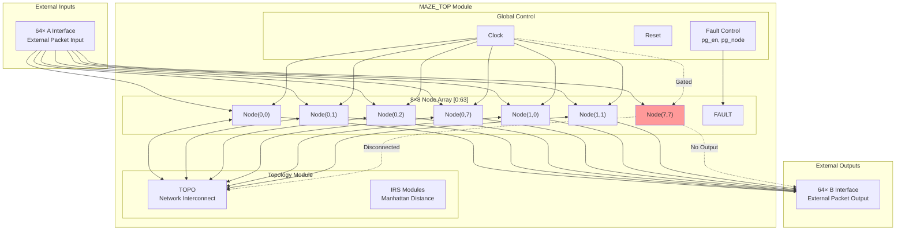
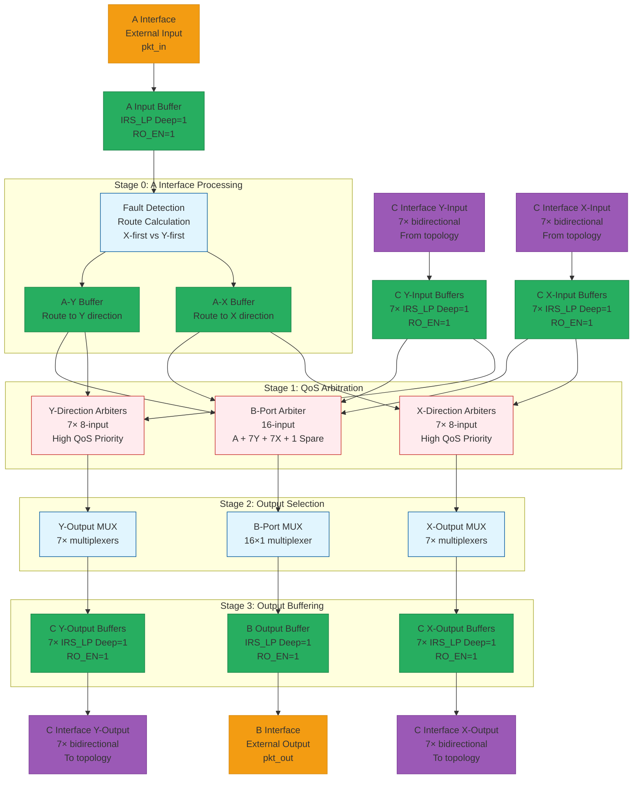
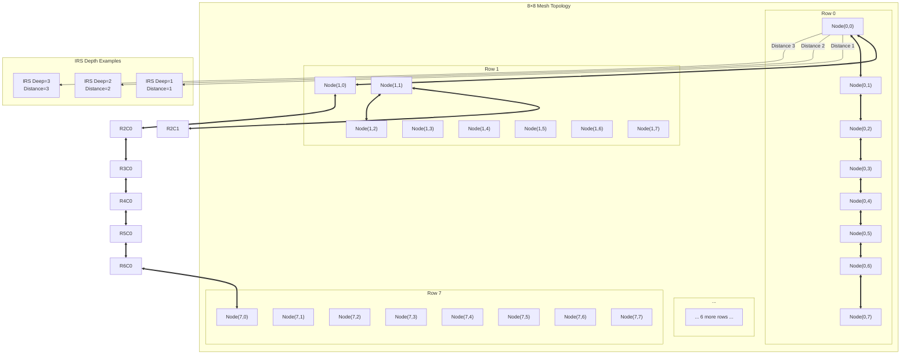
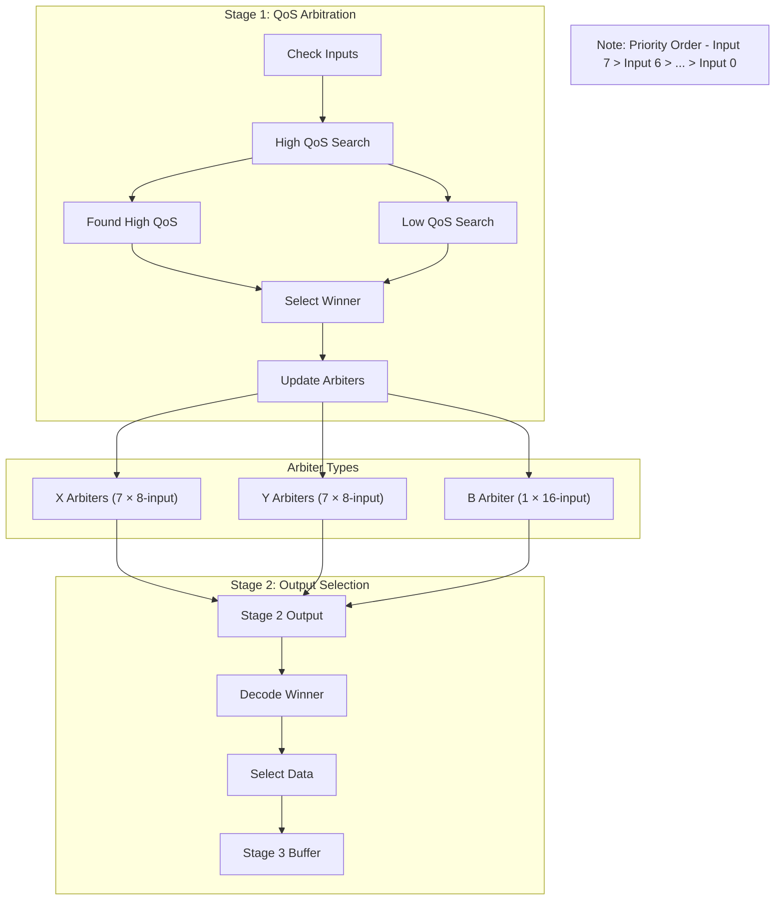
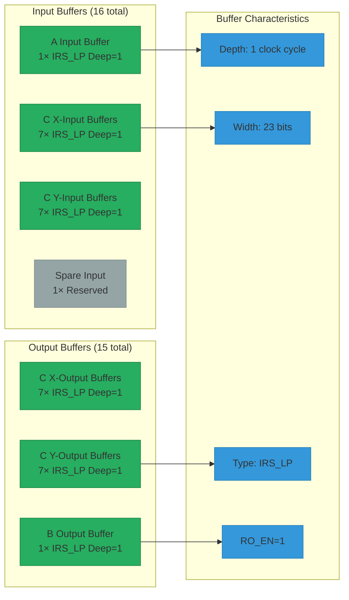

# MAZE 64-Node Network-on-Chip Architecture Diagrams

> **注意**: 本文档已针对Typora 8.8.0版本优化。如果您使用更新的Mermaid版本，部分图表可能支持更多高级功能。

## 1. System-Level Architecture



## 2. Node Internal Architecture (4-Stage Pipeline)



## 3. Packet Format and Data Flow

```mermaid
graph LR
    subgraph "Packet Structure [23 bits]"
        PKT_TYPE[Type: 2 bits<br/>00=Unicast<br/>01=X-Mcast<br/>10=Y-Mcast<br/>11=Bcast]
        PKT_QOS[QoS: 1 bit<br/>0=Low Priority<br/>1=High Priority]
        PKT_SRC[Source: 6 bits<br/>Node Coordinate]
        PKT_TGT[Target: 6 bits<br/>Node Coordinate]
        PKT_DATA[Data: 8 bits<br/>Payload]
    end

    subgraph "Routing Algorithm"
        SRC[Source Node<br/>X,Y coordinates]
        TGT[Target Node<br/>X,Y coordinates]
        INT1[Int1: [src_y, tgt_x]]
        INT2[Int2: [tgt_y, src_x]]

        FAULT_CHK{Fault Check}
        ROUTE_SEL{Route Selection}

        SRC --> INT1
        SRC --> INT2
        TGT --> INT1
        TGT --> INT2

        INT1 --> FAULT_CHK
        INT2 --> FAULT_CHK
        FAULT_CHK --> ROUTE_SEL
        ROUTE_SEL -->|X-first| X_ROUTE
        ROUTE_SEL -->|Y-first| Y_ROUTE
    end

    PKT_TYPE --> ROUTE_SEL
```

## 4. Network Topology Connections



## 5. QoS Arbitration Logic



## 6. Node Interface and Buffer Architecture

```mermaid
graph LR
    %% Left Side: Input Interfaces
    subgraph "Input Interfaces"
        direction TB
        A_PORT["A Interface Port<br/>pkt_in<br/>External Input"]

        C_X_IN_PORT["C Interface X-Input<br/>7× bidirectional<br/>From topology"]
        C_Y_IN_PORT["C Interface Y-Input<br/>7× bidirectional<br/>From topology"]
    end

    %% Node Core Processing
    subgraph "Node Core (Pipeline Processing)"
        direction TB

        subgraph "Stage 0: Input Processing"
            direction LR
            A_BUF["A Input Buffer<br/>IRS_LP Deep=1<br/>RO_EN=1"]
            C_X_IN_BUF["C X Input Buffers<br/>7× IRS_LP Deep=1<br/>RO_EN=1"]
            C_Y_IN_BUF["C Y Input Buffers<br/>7× IRS_LP Deep=1<br/>RO_EN=1"]
        end

        subgraph "Stage 1: QoS Arbitration"
            direction LR
            X_ARB["X-Direction Arbiters<br/>7× 8-input<br/>High QoS Priority"]
            Y_ARB["Y-Direction Arbiters<br/>7× 8-input<br/>High QoS Priority"]
            B_ARB["B-Port Arbiter<br/>16-input<br/>A + 7Y + 7X + 1 Spare"]
        end

        subgraph "Stage 2: Output Selection"
            direction LR
            X_MUX["X-Output MUX<br/>7× multiplexers"]
            Y_MUX["Y-Output MUX<br/>7× multiplexers"]
            B_MUX["B-Port MUX<br/>16×1 multiplexer"]
        end

        subgraph "Stage 3: Output Buffering"
            direction LR
            C_X_OUT_BUF["C X Output Buffers<br/>7× IRS_LP Deep=1<br/>RO_EN=1"]
            C_Y_OUT_BUF["C Y Output Buffers<br/>7× IRS_LP Deep=1<br/>RO_EN=1"]
            B_OUT_BUF["B Output Buffer<br/>IRS_LP Deep=1<br/>RO_EN=1"]
        end
    end

    %% Right Side: Output Interfaces
    subgraph "Output Interfaces"
        direction TB
        C_X_OUT_PORT["C Interface X-Output<br/>7× bidirectional<br/>To topology"]
        C_Y_OUT_PORT["C Interface Y-Output<br/>7× bidirectional<br/>To topology"]

        B_PORT["B Interface Port<br/>pkt_out<br/>External Output"]
    end

    %% Data Flow Connections
    %% Left Inputs to Stage 0
    A_PORT --> A_BUF
    C_X_IN_PORT --> C_X_IN_BUF
    C_Y_IN_PORT --> C_Y_IN_BUF

    %% Stage 0 to Stage 1
    A_BUF --> B_ARB
    C_X_IN_BUF --> X_ARB
    C_Y_IN_BUF --> Y_ARB
    C_X_IN_BUF --> B_ARB
    C_Y_IN_BUF --> B_ARB

    %% Stage 1 to Stage 2
    X_ARB --> X_MUX
    Y_ARB --> Y_MUX
    B_ARB --> B_MUX

    %% Stage 2 to Stage 3
    X_MUX --> C_X_OUT_BUF
    Y_MUX --> C_Y_OUT_BUF
    B_MUX --> B_OUT_BUF

    %% Stage 3 to Right Outputs
    C_X_OUT_BUF --> C_X_OUT_PORT
    C_Y_OUT_BUF --> C_Y_OUT_PORT
    B_OUT_BUF --> B_PORT

    %% Styling
    %% Left Input Interfaces
    style A_PORT fill:#F39C12,stroke:#D68910
    style C_X_IN_PORT fill:#9B59B6,stroke:#7D3C98
    style C_Y_IN_PORT fill:#9B59B6,stroke:#7D3C98

    %% Right Output Interfaces
    style B_PORT fill:#F39C12,stroke:#D68910
    style C_X_OUT_PORT fill:#9B59B6,stroke:#7D3C98
    style C_Y_OUT_PORT fill:#9B59B6,stroke:#7D3C98

    %% Internal Buffers (All IRS_LP Deep=1, RO_EN=1)
    style A_BUF fill:#27AE60,stroke:#1E8449
    style C_X_IN_BUF fill:#27AE60,stroke:#1E8449
    style C_Y_IN_BUF fill:#27AE60,stroke:#1E8449
    style C_X_OUT_BUF fill:#27AE60,stroke:#1E8449
    style C_Y_OUT_BUF fill:#27AE60,stroke:#1E8449
    style B_OUT_BUF fill:#27AE60,stroke:#1E8449

    %% Processing Units
    style X_ARB fill:#FFEBEE,stroke:#C62828
    style Y_ARB fill:#FFEBEE,stroke:#C62828
    style B_ARB fill:#FFEBEE,stroke:#C62828
    style X_MUX fill:#3498DB,stroke:#2980B9
    style Y_MUX fill:#3498DB,stroke:#2980B9
    style B_MUX fill:#3498DB,stroke:#2980B9
```



## 7. Buffer Architecture Summary



## 编辑说明

### 兼容的编辑工具
- **Typora 8.8.0**: ✅ 完全兼容（本文档专门优化）
- **draw.io**: ✅ 完全兼容
- **GitHub/GitLab**: ✅ 自动渲染
- **Mermaid Live Editor**: ✅ https://mermaid.live
- **更新版本的Mermaid**: ✅ 兼容，但可能有更多功能

### 编辑功能
您可以：
1. 修改节点名称和描述
2. 调整连接关系（-->, ---, <-->）
3. 添加或删除模块
4. 更新文本说明
5. 改变布局方向（LR, TB, RL, BT）
6. 修改颜色（使用style指令）

### Typora 特定说明
- 本文档已针对Typora 8.8.0优化
- 使用兼容语法：`graph` 替代 `flowchart`
- 避免使用 `classDef` 复杂样式
- 简化了复杂的状态图语法
- 如遇渲染问题，请检查：
  - 括号匹配：`[]` `{}` `()`
  - 引号配对：`"` 和 `'`
  - 特殊字符转义

### 每个图表的内容保证
每个图表都基于您的RTL代码分析，确保架构准确性！
- ✅ 64节点8×8网格拓扑
- ✅ 4级流水线处理
- ✅ QoS仲裁机制
- ✅ 故障容忍系统
- ✅ 接口定义和连接
- ✅ **A/B/C接口分离和缓冲器架构** (新增)
- ✅ **31个缓冲器详细结构 (16输入 + 15输出)** (新增)