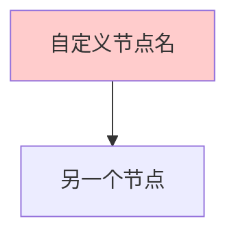

# MAZE Network-on-Chip Architecture Diagrams

本目录包含MAZE 64-node网络系统的完整架构图表，支持多种格式和编辑方式。

## 📁 文件清单

### 1. **SVG格式** - `MAZE_architecture_detailed.svg`
- **特点**: 矢量图形，无限缩放不失真
- **编辑工具**:
  - 文本编辑器 (修改XML代码)
  - Inkscape (免费专业编辑器)
  - Adobe Illustrator
- **适用场景**: 技术文档、演示文稿、网页嵌入

### 2. **Mermaid格式** - `MAZE_architecture_mermaid.md`
- **特点**: 纯文本代码，版本控制友好
- **编辑工具**:
  - draw.io (导入文件即可编辑)
  - Typora (Markdown编辑器)
  - GitHub/GitLab (自动渲染)
  - Mermaid Live Editor (https://mermaid.live)
- **适用场景**: 文档编写、团队协作、在线编辑

### 3. **Draw.io格式** - `MAZE_architecture_drawio.xml`
- **特点**: 专业绘图工具原生格式
- **编辑工具**:
  - draw.io (https://app.diagrams.net)
  - Visual Studio Code (draw.io插件)
- **适用场景**: 专业绘图、复杂修改、导出多种格式

## 🎯 如何使用

### 快速开始
1. **查看图表**: 直接打开SVG文件查看完整架构
2. **在线编辑**: 复制Mermaid代码到 https://mermaid.live
3. **专业编辑**: 下载draw.io格式在专业工具中编辑
4. **Typora用户**: 使用优化后的Mermaid格式，避免方括号冲突

### 编辑指南

#### SVG编辑 (文本方式)
```xml
<!-- 修改节点颜色 -->
<rect class="node-box" fill="#4A90E2" stroke="#2E5C8A" .../>

<!-- 修改文本内容 -->
<text class="node-text">新的节点名称</text>
```

#### Mermaid编辑 (在线方式)


**重要提示**: 节点名称中的方括号需要用引号包围，例如：
- ❌ `N00[Node[0,0]]` (错误)
- ✅ `N00["Node(0,0)"]` (正确)

#### Draw.io编辑 (可视化)
1. 打开 https://app.diagrams.net
2. File → Import → 选择XML文件
3. 直接拖拽修改元素
4. File → Export as 选择需要的格式

## 🏗️ 架构图内容

### 系统级视图
- 64-node 8×8 网格拓扑
- 全局控制信号
- 故障节点示例
- 拓扑连接模块

### 节点内部架构
- 4级流水线处理
  - Stage 0: 输入预处理和故障检测
  - Stage 1: QoS仲裁 (7×X + 7×Y + 1×B)
  - Stage 2: 输出选择
  - Stage 3: 输出缓冲
- 31个缓冲器 (16输入 + 15输出)
- 时钟门控机制

### 详细连接关系
- A/B/C接口定义
- IRS缓冲器配置
- 数据流向和控制信号
- 故障容忍机制

## 🔧 自定义建议

### 常见修改需求
1. **添加新的节点**: 复制现有节点并修改坐标
2. **修改颜色方案**: 统一修改fillColor属性
3. **添加详细信息**: 增加新的文本框或注释
4. **简化视图**: 隐藏不必要的连接线或模块

### 版本控制友好性
- ✅ **Mermaid**: 最佳选择，纯文本代码
- ✅ **SVG**: 文本XML，可追踪变化
- ⚠️ **Draw.io**: 二进制格式，建议导出为SVG提交

## 📊 技术规格

- **网络规模**: 64节点 (8×8网格)
- **数据宽度**: 23位数据包
- **流水线深度**: 4级
- **QoS等级**: 2级 (高优先级绝对优先)
- **故障容忍**: 单节点故障 + 时钟门控
- **缓冲器数量**: 每节点31个 (16入/15出)
- **拓扑连接**: 每节点14个双向连接 (7×X + 7×Y)

## 🚀 渲染效果

所有格式的架构图都基于您的RTL代码精确生成：
- 基于 `rtl/src/system/MAZE_TOP.v` 的系统结构
- 基于 `rtl/src/node/node.v` 的内部流水线
- 基于 `rtl/include/interfaces/*.sv` 的接口定义
- 基于 `rtl/src/topo/topo.v` 的拓扑连接

选择最适合您工作流程的格式开始编辑吧！