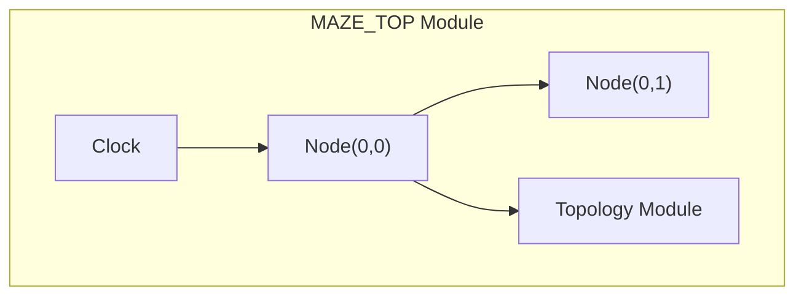
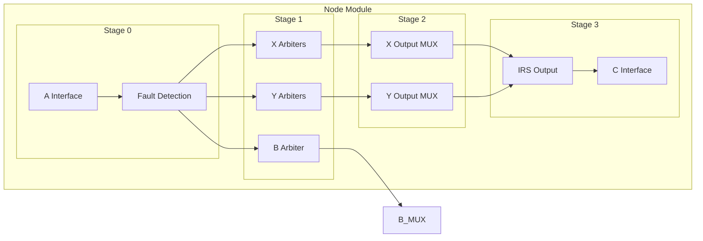
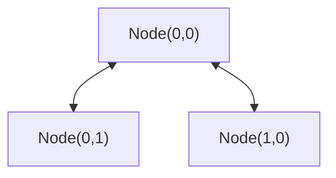
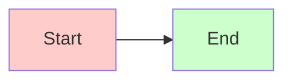
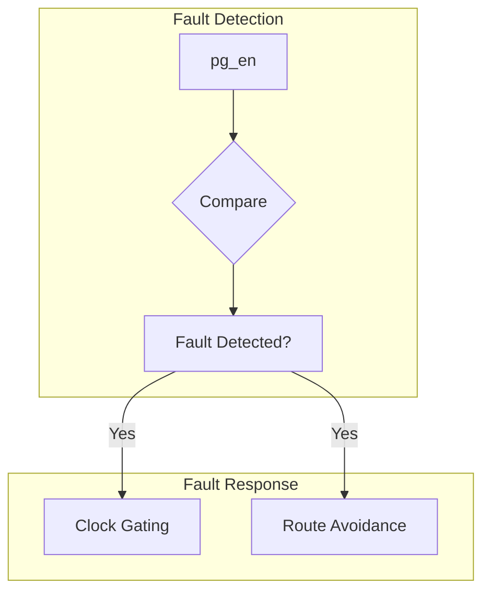

# Mermaid 语法测试

请逐个复制这些代码块到Typora中测试，找到有问题的图表。

---

## 测试1: 基础图表

---

## 测试2: System Architecture

---

## 测试3: Node Architecture (最复杂的一个)

---

## 测试4: 简化的连接图

---

## 测试5: 带样式的图表

---

## 测试6: 复杂的故障处理图

---

## 调试步骤

1. **复制单个测试代码块**到Typora中
2. **查看是否报错**
3. **记录报错的测试编号**
4. **告诉我哪个测试失败了**

如果测试1-2正常，但测试3失败，问题可能在于嵌套层数过多。如果测试5失败，问题可能在于样式语法。

这样我就能精确定位问题所在！