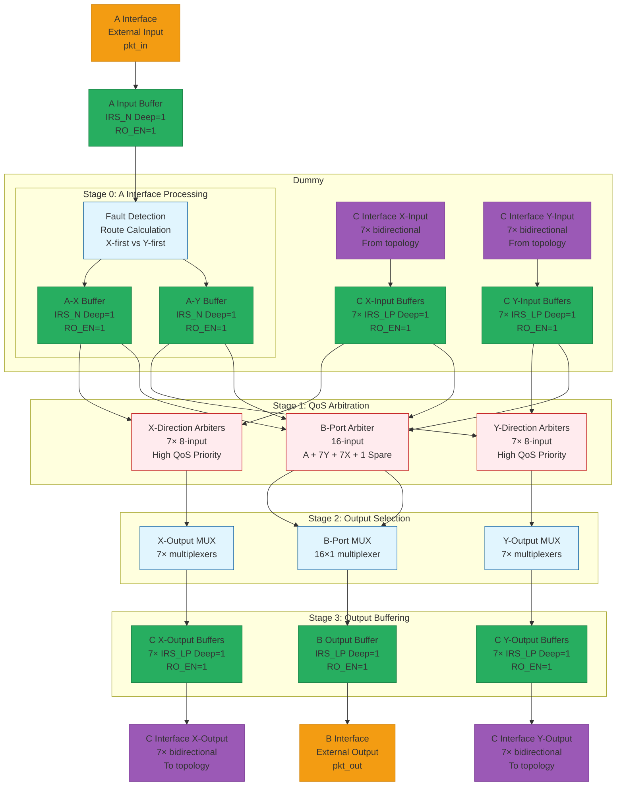

# MAZE Node Pipeline Architecture

## Overview

本文档详细描述了MAZE网络中单个节点的4级流水线架构。每个节点负责处理输入数据包、进行QoS仲裁、选择输出路径，并与网络拓扑进行通信。

## Node Architecture Diagram

## Pipeline Stages Detailed Description

### Stage 0: Input Processing

**Purpose**: 处理A接口输入数据包，进行故障检测和路由计算

**Components**:
- **A Input Buffer**: IRS_LP深度1，RO_EN=1，缓冲外部输入数据包
- **Fault Detection**: 检测中间节点故障，计算最优路由
- **Route Calculation**: 决定X-first或Y-first路由策略
- **A-X Buffer**: 路由到X方向的缓冲器
- **A-Y Buffer**: 路由到Y方向的缓冲器

**Key Features**:
- 只有A接口数据包经过故障检测
- C接口数据包直接进入Stage 1，无需故障检测
- 支持两跳路由策略
- 故障节点自动绕行

### Stage 1: QoS Arbitration

**Purpose**: 对输入数据包进行服务质量仲裁，选择获胜者

**Components**:
- **X-Direction Arbiters**: 7个8输入仲裁器，高QoS绝对优先
- **Y-Direction Arbiters**: 7个8输入仲裁器，高QoS绝对优先
- **B-Port Arbiter**: 16输入仲裁器(A+7Y+7X+1备用)

**Arbitration Logic**:
- 高QoS数据包绝对优先
- 相同QoS按固定优先级顺序
- 支持轮询和公平仲裁策略
- 低延迟仲裁决策

### Stage 2: Output Selection

**Purpose**: 根据仲裁结果选择输出数据包

**Components**:
- **X-Output MUX**: 7个多路复用器，选择X方向输出
- **Y-Output MUX**: 7个多路复用器，选择Y方向输出
- **B-Port MUX**: 16×1多路复用器，选择外部输出

**Selection Logic**:
- 基于仲裁器获胜信号
- 支持优先级抢占
- 保证数据完整性
- 避免死锁

### Stage 3: Output Buffering

**Purpose**: 缓冲输出数据包，提供背压支持

**Components**:
- **C X-Output Buffers**: 7个IRS_LP深度1，用于X方向网络传输
- **C Y-Output Buffers**: 7个IRS_LP深度1，用于Y方向网络传输
- **B Output Buffer**: 1个IRS_LP深度1，用于外部输出

**Buffer Characteristics**:
- 所有缓冲器: IRS_LP类型
- 深度: 1个时钟周期
- RO_EN=1: 读使能激活
- 支持Valid/Ready握手协议

## Interface Specifications

### Input Interfaces

#### A Interface (External Input)
- **Purpose**: 接收外部数据包
- **Width**: 23位数据包
- **Signals**: vld, qos, type, src, tgt, data, rdy
- **Buffer**: IRS_LP Deep=1, RO_EN=1

#### C Interface (Network Topology)
- **C-X Input**: 7个双向连接，来自拓扑的X方向输入
- **C-Y Input**: 7个双向连接，来自拓扑的Y方向输入
- **Buffer**: IRS_LP Deep=1, RO_EN=1 per connection
- **Purpose**: 节点间数据传输

### Output Interfaces

#### B Interface (External Output)
- **Purpose**: 外部数据包输出
- **Width**: 23位数据包
- **Signals**: vld, qos, type, src, tgt, data, rdy
- **Buffer**: IRS_LP Deep=1, RO_EN=1

#### C Interface (Network Topology)
- **C-X Output**: 7个双向连接，到拓扑的X方向输出
- **C-Y Output**: 7个双向连接，到拓扑的Y方向输出
- **Buffer**: IRS_LP Deep=1, RO_EN=1 per connection
- **Purpose**: 节点间数据传输

## Data Flow Summary

### Input Processing Flow
1. **A Path**: A Port → A Buffer → Fault Detection → A-X/A-Y Buffers
2. **C-X Path**: C-X Port → C-X Buffer → X Arbiter
3. **C-Y Path**: C-Y Port → C-Y Buffer → Y Arbiter

### Arbitration Flow
1. **X-Arbiter**: A-X + C-X → X MUX
2. **Y-Arbiter**: A-Y + C-Y → Y MUX
3. **B-Arbiter**: A-X + A-Y + C-X + C-Y → B MUX

### Output Flow
1. **X-Output**: X MUX → C-X Output Buffer → C-X Port
2. **Y-Output**: Y MUX → C-Y Output Buffer → C-Y Port
3. **B-Output**: B MUX → B Output Buffer → B Port

## Performance Characteristics

### Latency
- **Pipeline Stages**: 4个时钟周期
- **Unicast Latency**: 4 + 2 hops = 6 cycles minimum
- **Arbitration Latency**: 1 cycle (pipelined)
- **Buffer Latency**: 1 cycle per buffer

### Throughput
- **Peak Throughput**: 1 packet per cycle per direction
- **Sustained Throughput**: Depends on QoS mix and arbitration
- **Network Capacity**: 14 bidirectional connections per node

### QoS Features
- **Priority Levels**: 2 (High/Low)
- **High Priority**: Absolute priority over low priority
- **Fairness**: Configurable arbitration policies
- **Deadlock Prevention**: Built-in arbitration logic

## Key Design Decisions

### 4-Stage Pipeline Architecture
- **Modularity**: 每个Stage专注特定功能
- **Pipelining**: 高吞吐量设计
- **Scalability**: 易于扩展和修改

### Separate A and C Processing
- **Efficiency**: 只有A接口需要故障检测
- **Simplicity**: C接口直接处理
- **Performance**: 减少不必要的处理延迟

### IRS Buffer Integration
- **Standardization**: 统一的缓冲器类型
- **Flexibility**: 易于调整深度和参数
- **Reliability**: 经过验证的缓冲器设计

## Implementation Notes

### RTL Mapping
- **Node Module**: `rtl/src/node/node.v`
- **Interface Definitions**: `rtl/include/interfaces/`
- **IRS Library**: `rtl/lib/irs/irs.v`

### Verification Strategy
- **Unit Testing**: 每个Stage独立验证
- **Integration Testing**: 流水线整体验证
- **System Testing**: 网络级验证
- **Performance Testing**: QoS和延迟验证

### Synthesis Considerations
- **Timing**: 4级流水线时序收敛
- **Area**: 31个缓冲器 + 仲裁器逻辑
- **Power**: 时钟门控和动态功耗管理
- **Scalability**: 参数化设计支持不同规模

---

*This document describes the detailed architecture of a single MAZE node's 4-stage pipeline processing unit, designed for high-performance Network-on-Chip communication with QoS support and fault tolerance.*